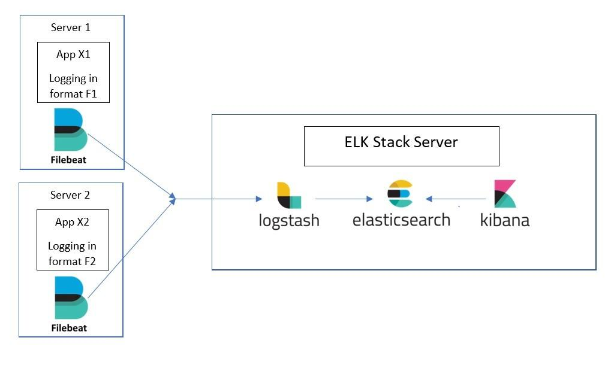
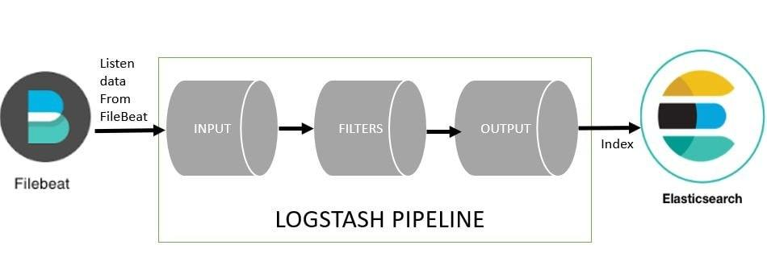
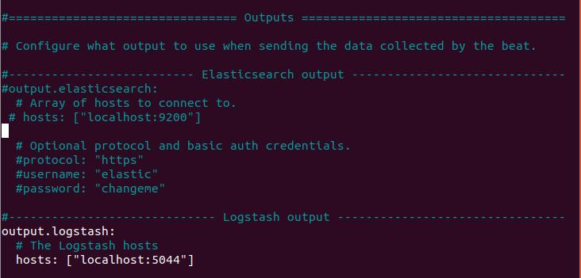
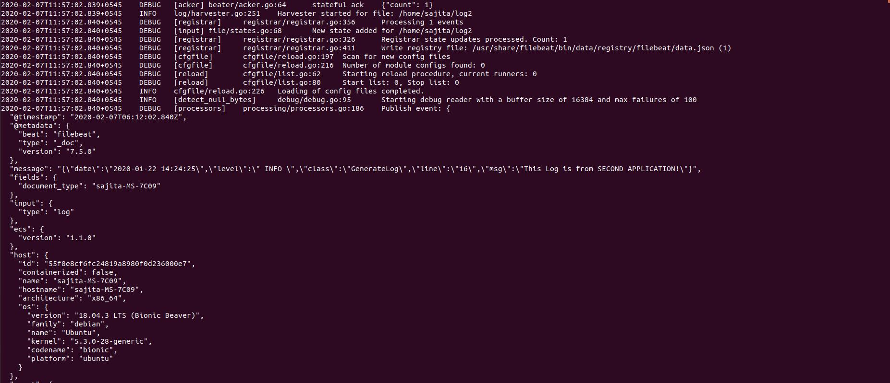
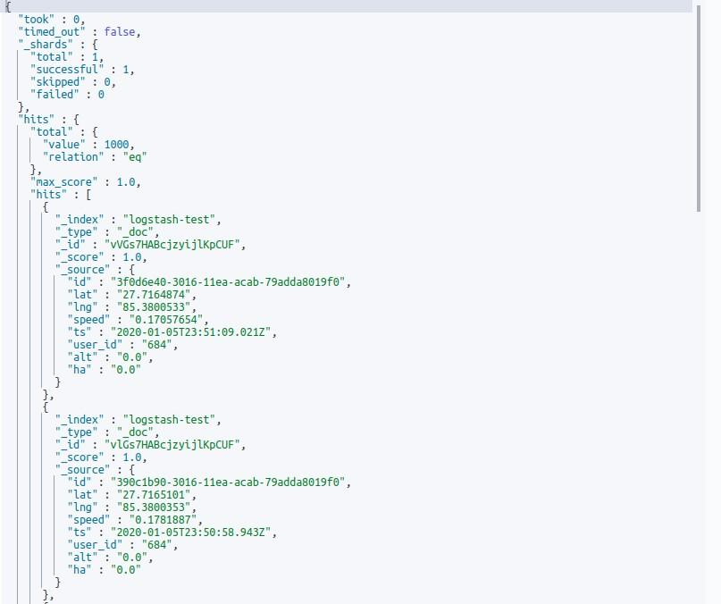

# Introduction to Logstash and Filebeat

## Filebeat

FileBeat is basically a data-shipper that belongs to the Beats family. We can install this shipper on
servers as per our requirements. It ships with modules to gather logs such as access logs or error from
variety of inputs such as nginx, system, the Apache web server or MySql etc. They, then send log
entries to either Elasticsearch or Logstash.

## Logstash


Simply, we can define logstash as a data parser. We can use logstash to collect logs, parse them and
store them for later use. The data that Logstash receives, could be log file entries, chat messages etc.


These data are then processed by Logstash and shipped off to one or more destinations such as
Elasticsearch, a Kafka queue etc. If we store in elasticsearch we can view and analyze them with
kibana.

## Configuring logstash with filebeat

Here, in this article I have installed filebeat (version 7.5.0) and logstash (version 7.5.0) using debian
package. And version of the stack (Elasticsearch and kibana) that I am using currently is also 7.5.0.

## Filebeat setup

**Step 1: Download filebeat debian package from:**

- **https://www.elastic.co/downloads/past-releases
Step 2: Install the package via command:**
- sudo dpkg -i filebeat-7.5.0-amd64.deb

**Expected output :**


**Step 3: Provide ownership**

After you are done with installation you need to provide ownership to following files. If you don’t
provide ownership to these files you will face the error of permission denied afterwards while running
filebeat.

Run the command below to provide ownership:

- sudo chown -R $USER:$USER /etc/filebeat/
- sudo chown -R $USER:$USER /usr/share/filebeat
- sudo chmod +x /usr/share/filebeat/bin/
- sudo chown -R $USER:$USER /var/log/filebeat/
- sudo chown -R $USER:$USER /etc/default/filebeat
- sudo chown -R $USER:$USER /var/lib/filebeat/


eg :


**Step 4: Edit the filebeat.yml file located inside /etc/filebeat/filebeat.yml and make following
changes.**

- sudo nano /etc/filebeat/filebeat.yml

eg :


Here, in above configuration:


```
enabled: true If not set to true then it won’t do any work.
Paths:
```

- _home_ /sajita/log

```
Here, we can list which log file we want to read. I
have listed only one file log2 in this configuration.
```

eg: 


**document_type:** the type to be published in the ‘type’ field of logstash configuration.

As we will sent the log to the logstash so we need do the following task:

- make # for all other outputs and in the host’s field, specify the IP address of the logstash.
- Rem out the ElasticSearch output as we use logstash to write there.
- Unrem the Logstash lines.
- Tell Beats where to find LogStash.
- Make sure you rem out the line #output.elasticsearch too.

eg:


**Step 5: Start filebeat**

- bin/filebeat -c /etc/filebeat/filebeat.yml -e -d "*"


```
-e tells to write logs to stdout, so we can see it working and check for errors.
```
**Expected Output :**



## Logstash setup

Before setup let’s discuss a little about logstash pipeline. A Logstash pipeline consists of three stages:

**i. Input stage:** Input stage is how the Logstash receives the data. An input plugin could be a file
so that the Logstash reads events from a file, It could be filebeat or any other beat or it could be
even a Kafka queue.

**ii. Filter Stage:** Filter stage is about how logstash would process the events receive from Input
stage plugins. Here we can parse CSV, XML or JSON.

**iii. Output Stage:** Output Stage is all about where we send the processed events to. These places
can be an Elasticsearch instance, a Kafka queue or a File and so on.

**Setup Process:

Step 1: Download logstash debian package from:**

- https://www.elastic.co/downloads/past-releases

**Step 2: Install the package via command:**
- sudo dpkg -i logstash-7.5.0-amd64.deb


eg: 


**Step 3: Provide ownership**

After you are done with installation you need to provide ownership to following files. If you don’t
provide ownership to these files you will face the error of permission denied afterwards while running
logstash.

**Run the command below to provide ownership:**

- sudo chown -R $USER:$USER /etc/logstash/
- sudo chown -R $USER:$USER /usr/share/logstash/
- sudo chmod +x /usr/share/logstash/bin/
- sudo chown -R $USER:$USER /var/log/logstash/
- sudo chown -R $USER:$USER /etc/default/logstash
- sudo chown -R $USER:$USER /var/lib/logstash/
eg :


**Step 4: Check pipelines.yml file inside etc/logstash and make sure configuration looks like this:**

eg :


**Step 5: Initialize a custom template inside /etc/logstash** with correct mappings.

Here, the log that I am processing is in json format so I have configured pipeline and template
accordingly.
**My log format**

eg : 9


I have created a template named log_temp.json for above log format.

eg:


Content of template looks like this according to my log file.
eg:


Logstash uses this template and creates index in elasticsearch according to the mapping provided.

**Step 6: Configure Logstash pipeline inside /etc/logstash/conf.d to ingest data from filebeat.**

- sudo nano /etc/logstash/conf.d/test1.conf

eg:


Test1.conf pipeline consist of following content:

eg: 


**In above configuration:**

```
input Tell logstash to listen to Beats on port 5044
Filter{
grok{
```
```
It’s a file parser tool. It basically understands
different file formats. It can be extended too.
Output{
elasticsearch{}
```
```
The data that we have filtered is output to target.
(here elasticsearch)
stdout { codec => rubydebug } writes the output to stdout so we can see that is it
working.
```
- document_type : hostname→ we use this to filter from which host the data is coming from.
- parsed_json field→ Contains log data only.
- Mutate filter→ maps our log data into new fields.
- Prune and whitelist→ they are used to output only those data that we want to specify in output
    section.


**Note:** we need to specify date format in both filter and template otherwise it will throw an error stating
that it could not recognize the date format and logstash won’t be able to insert data to elasticsearch
index.

**Step7: Start logstash**

- bin/logstash -f /etc/logstash/conf.d/logstash-log.conf --path.settings /etc/logstash/

**Expected output :**


Now our "stash" here is Elasticsearch. If we run the above configuration logstash will index the sample
documents into Elasticsearch according to the mapping provided by us. Now we can retrieve the data
through the **Elasticsearch GET API**.


**Expected Output ** :



